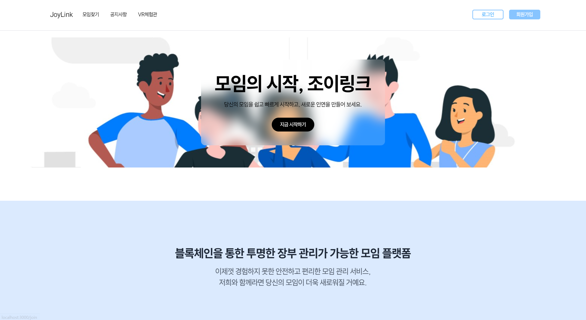

## 🙌 안녕하세요. Joylink를 만든 Team 무궁무진 입니다!

## 🥇Team 무궁무진
#### 디지털스마트부산아카데미 제4기 웹프로그래밍과정
||||||
| :---: | :---: | :---: | :---: | :---: |
|최세윤|박현준|김범규|박기재|손가얼|
|휴먼ICT융합전공|컴퓨터공학전공|컴퓨터공학전공|컴퓨터공학전공|경제학부|
|VR,FE|VR,BE| TeamLeader | FE, Design | FE,Design |

## 📚 개발 스택

### FrontEnd

  
### Backend

### BlockChain

, Hardhat

### VR

### collaborated with

## 📌 주요 기능

### ⭐ 모임 (동아리) 가입 및 생성 기능
<ul>▪️ 원하는 모임을 찾아 가입신청을 하거나, 없을 경우 생성가능 </ul>
<ul>▪️ 카테고리 별로 모임을 분류하여 원하는 모임을 쉽게 찾을 수 있다!  </ul>

### ⭐ 블록체인을 이용한 장부관리 기능 
<ul> ▪️ DB에 들어갈 장부 데이터를 해싱하여 블록체인에 추가로 저장</ul>
<ul> ▪️ 누구나 블록체인의 Data와 DB의 비교로 무결성 검증 가능 </ul>
😢 현재는 비용 문제로 BlockChain 기능은 개발만 끝내고 실 배포 X 😢

### ⭐ VR을 활용한 모임 홍보관 기능
<ul> ▪️ 각 동아리 별로 VR 홍보 부스를 만들어 좀 더 재밌는 모임찾기 가능! 
<ul> ※ 추후 VR 동아리 부스 커스텀 등 개발 예정...! </ul>
</ul>

## 화면 구성
|메인페이지|마이페이지|
| :---: | :---: |
|||
|모임상세페이지|마이클럽페이지|
|||
|VR홍보관|장부페이지|
|||
